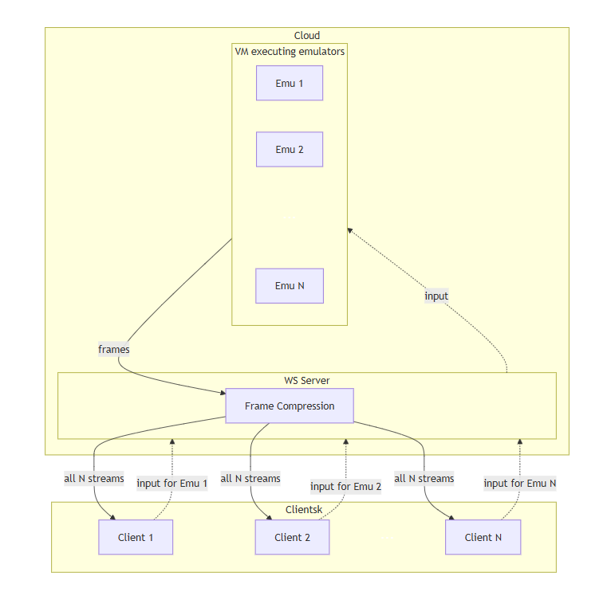

# Scalable Multi-Instance Game Streaming: Lossless Frame Compression for Cloud-Hosted Game Boy Emulators

## Abstract

This thesis evaluates real-time lossless compression for multiple Game Boy emulator instances running Tetris on a single cloud VM (Virtual Machine). Each browser client controls one instance and receives frames from all instances. The goal is to enable N streams at 60 fps per client within a constrained downlink (≈1 Mbit/s) by exploiting temporal and cross-instance redundancy while keeping latency and CPU overhead low.

## 1. Problem and Setting

Each emulator outputs 160×144 frames at 2 bpp (≈5.76 KB) at 60 fps. The native Game Boy framebuffer uses 2 bits per pixel (4 shades of gray), giving a packed frame size of 160×144×2/8 = 5,760 bytes. Compression operates on this native 2 bpp representation, any color mapping is performed on the client after decompression. When clients receive all N streams, uncompressed bandwidth scales as N×60×5.76×8 Kbit/s, exceeding the bandwidth constraint already at N = 1. We need a lossless, low-latency encoder on the server and a fast browser decoder so clients can render 60 fps while staying within the bandwidth cap.

All N streams destined for a single client are multiplexed over one WebSocket connection. This requires a lightweight framing or multiplexing protocol so that the client can demultiplex incoming messages and associate each compressed frame with its source emulator instance.

### Keyframes and State Resynchronization

Delta-based compression requires both encoder and decoder to share a consistent reference state. Without periodic keyframes (full, non-delta frames), several scenarios become problematic: a client joining a session mid-stream, a client reconnecting after a connection drop, or a client falling behind and missing frames. The codec design (timeline step 5) will include a keyframe strategy that addresses these cases, for example by sending a full reference frame on connection start and at regular intervals or on demand.

### Architecture (high level)



Solid arrows: compressed frame streams. Dashed arrows: client inputs routed to the VM.

## 2. Research Questions

- RQ1: Which lossless techniques (per-frame, consecutive frame deltas, cross-instance references) reduce bitrate enough to deliver N×60 fps within ≈1 Mbit/s network per client?
- RQ2: What are the encode/decode CPU, memory and latency costs when these techniques are applied on server and client?

## 3. Timeline

1. Implement the system as presented in the "Architecture" diagram, without frame compression. At this point one should be able to control a Tetris game running on a cloud VM through their browser and receive game frames of other users.
2. Implement test suite on top the system built in step 1. The suite consists of artificial network throttling, a comprehensive measuring system, and a way to seed the emulator such that results are reproducible (see Section 4.1).
3. Measure metrics defined in Section 4 against the baseline implementation under a limited network, using N in {1, 2, 4, 8, 16}. The baseline sends fully uncompressed raw frames with WebSockets. A secondary baseline with `permessage-deflate` enabled will also be recorded for comparison. The upper end of the N range (16) is chosen to stress bandwidth well beyond the cap.
4. Benchmark at least one established lossless video codec (e.g. lossless H.264 or AV1) to provide a reference point between the baselines and a custom codec using the same N values and metrics as step 3.
5. Design and implement at least one lossless codec scheme using methods such as temporal deltas and cross-instance references.
6. Repeat step 3 against a system with the codec from step 5. In addition, measure maximum N under the bandwidth cap.
7. Compare measurements from steps 3 and 4 to step 6.
8. Document findings, make the implementation public and finalize first revision of the thesis.
9. Hand thesis over for supervisor review and address supervisor comments. Repeat until ready.

## 4. Evaluation Metrics

- Compression ratio (per-frame and aggregate)
- Achieved fps per stream
- End-to-end latency, with granular reporting (time from frame generation in the cloud to displaying the frame in the browser)
- CPU and memory usage for encode/decode on server and client (asymptotic analysis)

These metrics are evaluated under different game phases (main menu, in-game, game over, etc.). Phases will be properly categorized.

### 4.1 Experiment Reproducibility

Tetris uses a pseudo-random number generator (PRNG) to determine which pieces drop in the game. The PRNG is based on the Game Boy internal timer, which can be manipulated. To ensure reproducibility, experiments follow these practices. Input sequences are scripted so that each configuration processes identical workloads. The Tetris PRNG is manipulated to achieve this. Each configuration is run for a minimum of five independent trials. Results report the mean together with the standard deviation or 95% confidence interval. All scripts, configuration files, and raw measurement data are published alongside the thesis source code so that the experiments can be replicated.

## 5. Relevant research fields/material

- [WebSocket messaging](https://arxiv.org/abs/1409.3367)
- Lossless compression
  - [Motion compensation in video compression](https://www.sciencedirect.com/science/article/abs/pii/S0923596504000578)
  - [Run length encoding](https://ieeexplore.ieee.org/abstract/document/8978464)
  - [LZ4 compression algorithm](https://ieeexplore.ieee.org/abstract/document/7440278)
  - [Zstandard compression algorithm](https://www.rfc-editor.org/rfc/rfc8878)
- [Game Boy](https://gbdev.io/pandocs/About.html)
- Inter-instance redundancy exploitation in compression
  - Any papers about compression algorithms exploiting inter-frame redundancy (such as [AV1](https://arxiv.org/abs/2008.06091))
- [Cloud gaming](https://ieeexplore.ieee.org/abstract/document/8057197)

## 6. Assumptions

- Lossless means pixel-perfect framebuffer reconstruction. Furthermore, the process of compressing and decompressing is deterministic.
- Bandwidth is constrained to as close to 1 Mbit/s as possible per client.
- The ~1 Mbit/s constraint refers to application-layer payload only (compressed frame data and multiplexing headers). Protocol overhead (WebSocket framing, TCP/IP headers, TLS record headers) is excluded from this cap. The overhead percentage will be estimated and reported separately during measurements so that total bandwidth is transparent.
- Emulator frame generation speed is assumed to be near constant, regardless of N. Vertical scaling of compute in the cloud justifies this assumption.
- The time it takes for a frame to be transferred from an emulator to the WS server is assumed to be instantaneous.
- All N emulator instances are frame-locked to a shared tick: every tick, each instance advances exactly one frame before compression begins. This simplifies cross-instance delta compression because corresponding frames from different instances share the same logical timestamp.
- The target client environment is a modern desktop browser (Chrome, Firefox, or Safari, latest two major versions). Mobile devices and older browsers are out of scope. The client-side decoders will be implemented in both JavaScript and WebAssembly, and both variants will be benchmarked in all settings.
- Real networks can have variable latency, jitter, and packet loss. In this work, experiments assume a reliable, low-jitter network where only bandwidth is throttled (see timeline step 2). The artificial throttling is applied at the application to simulate a constrained but otherwise consistent network. Studying the effects of packet loss and jitter is left for future work.
- Experiments are conducted on a VM with X vCPUs and Y GB RAM. The exact specification will be reported alongside results.
- The number of emulator instances N is fixed for the duration of each experiment. Dynamic client join and leave (and its impact on cross-instance references and keyframe synchronization) is left for future work.

## 7. Scope

- Single game (Tetris) and single VM running the emulators, broader generalization future work.
- Emulator performance evaluation is not included in the scope.
- Emulator sound generation and transmission is not included in the scope, this is left for future work.
- Optimizing input delivery to emulators is out of scope and left for future work.

```

```
